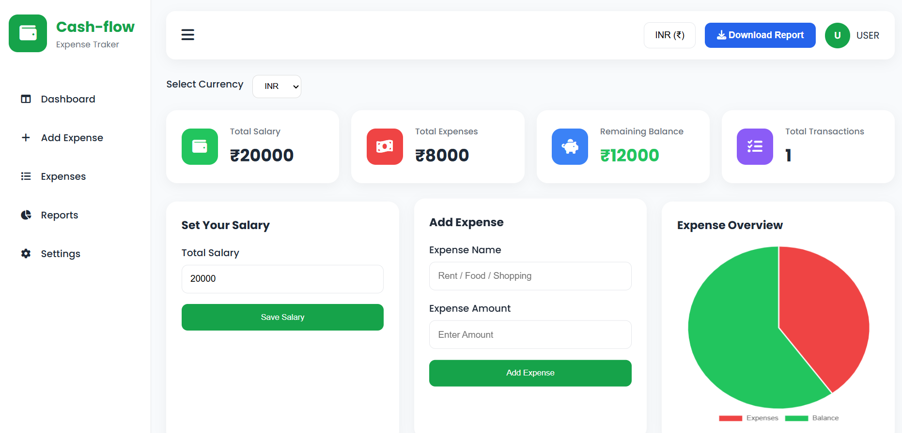

# 💰 Cash Flow - Salary & Expense Tracker

A responsive Salary & Expense Tracker built using **HTML, CSS, and Vanilla JavaScript**. This project helps users manage their income and expenses while providing real-time balance calculations, data persistence, charts, and report generation.

---

## 🚀 Live website

🔗 Live Website: https://cash-flow-expense-tracker-iota.vercel.app/

🔗 Demo Video: https://drive.google.com/file/d/1aO65BF6OrLjsiOy3D54ZSV-TcwFdGvmd/view?usp=drive_link


## 📂 GitHub Repository

🔗 https://github.com/sakshi192004/Cash-Flow-Expense-Tracker


## 📷 Screenshot

### Dashboard



---


# 📌 Features

- Set Total Salary
- Add New Expenses
- Dynamic Expense List
- Real-time Balance Calculation
- Input Validation
- Responsive User Interface
- LocalStorage Integration
- Delete Expense
- Dynamic Pie Chart (Chart.js)
- Automatic Summary Cards
- Transaction Counter
- Download Expense Report (PDF)
- Currency Converter API
- Threshold Warning Alert


# 🛠️ Technologies Used

- HTML5
- CSS3
- JavaScript (ES6)
- Chart.js
- jsPDF
- Exchange Rate API

---

# 📁 Folder Structure

```
Cash-Flow-Expense-Tracker/
│
├── index.html
├── style.css
├── script.js
├── README.md
├── prompts.md
└── assets/
```

---


# 📖 Learning Outcomes

During this project I learned:

- DOM Manipulation
- Event Handling
- JavaScript Functions
- LocalStorage
- Dynamic Rendering
- Array Operations
- CRUD Operations
- Fetch API
- Async/Await
- Chart.js Integration
- jsPDF Integration
- Responsive Design

---

